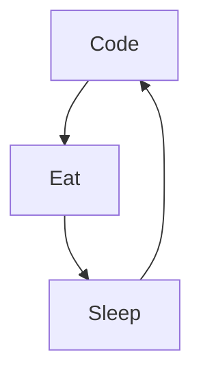

# Hi there 

## 🚀 About Me

🎓 I am Naquo, a **Full Stack Web Developer**. I am currently searching for projects in order to gain professional experience.

## 🛠️ Skills

### Frontend

  
  
  
  
  

### Backend

  

### Tools

  
  

###

## ⭐ Stats

